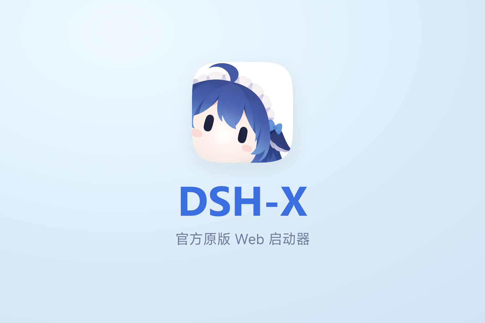
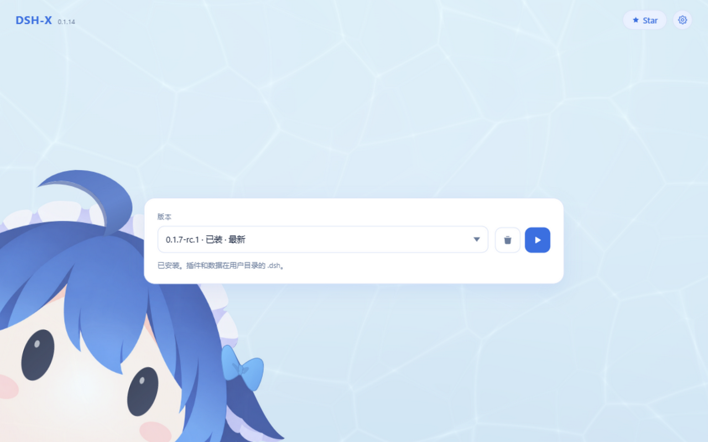
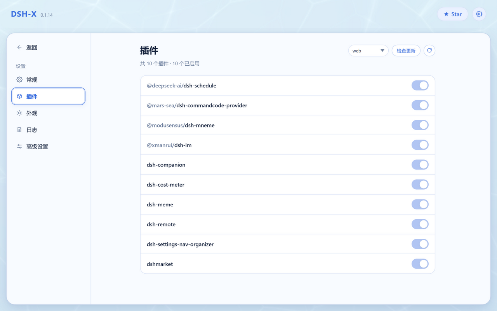
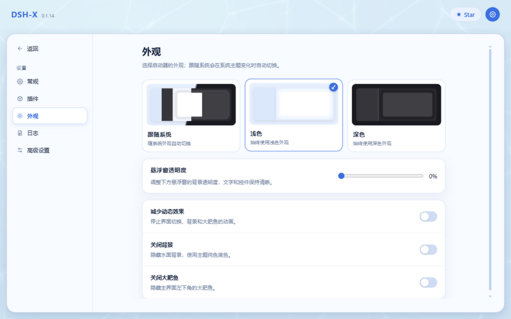

<p align="center">
  
</p>

<p align="center">
  <a href="https://yyh-001.github.io/DSH-X/">Website</a>
  ·
  <a href="https://github.com/yyh-001/DSH-X/releases/latest/download/DSH-Setup.exe">Download</a>
  ·
  <a href="https://github.com/yyh-001/DSH-X">Star</a>
  ·
  <a href="README.md">中文</a>
</p>

A lightweight launcher for DeepSeek Harness. Pick a version, start DSH web.

> [!IMPORTANT]
> **DSH-X starts DeepSeek Harness's own web page, not a desktop app.**  
> It only handles version installation, launching and plugin management: no embedded WebView, and no changes to DSH's web UI. DSH-X is a community project, not an official DeepSeek product.

## Features

- **Pick a version and go**: start / stop / restart / update / uninstall
- **macOS support**: a native `.app` and dmg installers (one for Apple Silicon, one for Intel); self-update, launch at login and the folder picker all use the system's own mechanisms
- **Plugins page**: list installed plugins and toggle each with one click, check for and install updates (one or all), and switch profiles
- **Compatibility mode**: on a failed start, disable the plugins named in the error (one click to restore); after boot it checks the client plugin bundles the page references and reports the verdict, telling a broken install apart from a stale tab
- **S3 sync**: back up chat sessions, attachments and plugin config to any S3-compatible bucket (AWS / R2 / MinIO / OSS…) and pull them back on another machine; the plugin manifest is merged in both directions, so neither machine loses a plugin
- **Dark appearance**: follow the system or pick a theme, plus floating-panel transparency and mascot switches
- **Faster startup**: equivalent fast implementations at the bundle composition point (saves about 1–2 s), skipped automatically once dsh changes underneath
- **Plugins stay where dsh puts them**: data lives in `~/.dsh`, so switching versions needs no plugin reinstall
- **Keeps one older version**: only the newest and the most recently installed are kept (enough to roll back); older ones are pruned after install
- **Resident in the background**: closing the page does not quit (Windows tray / macOS menu bar icon); the UI uses your system browser
- **Bundled Node / npm / pnpm**: a portable runtime ships inside the package, packages come from the npmmirror registry, and plugin installs need nothing from the host
- **One version at a time**: no two versions fighting over ports and data
- **Optional marketplace**: can install `dshmarket` on first launch

Feedback: **QQ group [993579665](https://qm.qq.com/q/7AD2g70HqS)**

## Screenshots

<p align="center">
  
</p>

<p align="center">
  
</p>

<p align="center">
  
</p>

## Antivirus false positives

The launcher is not code-signed and behaves a bit like a downloader to heuristics (it spawns `cmd` / `powershell`, can write an autostart entry, ships its own Node runtime, downloads an installer to self-update), so Windows Defender or another antivirus may occasionally block it.

If it does: add the install directory (default `%LOCALAPPDATA%\Programs\DSH`) to the exclusions, and report the false positive to [Microsoft](https://www.microsoft.com/en-us/wdsi/filesubmission) (choose "software developer", upload `DSH-Setup.exe`) — usually reverted in a day or two; other vendors (360, Huorong, …) have their own forms. A SmartScreen "unknown publisher" prompt after downloading is expected: click "Run anyway".

## Usage

Windows: install [DSH-Setup.exe](https://github.com/yyh-001/DSH-X/releases/latest), then open **DSH-X** from the desktop.

macOS: open `DSH-X-mac-arm64.dmg` (Apple Silicon) or `DSH-X-mac-x64.dmg` (Intel) and drag **DSH-X** into Applications. The app is not notarized, so the first launch needs right-click → **Open**; self-update also needs the app to sit in a writable folder. Settings and logs live in `~/Library/Application Support/DSH`.

The manager page and dsh's own web page open in your default browser; the manager defaults to `http://127.0.0.1:3780/` (the port can be changed on the settings page). To reach dsh from a phone or another computer: settings → Advanced → **Web binding** → LAN, applied the next time dsh starts.

Verifying a download (optional): the releases page lists a sha256 next to every file — compare it locally with `certutil -hashfile DSH-Setup.exe SHA256` (Windows) or `shasum -a 256 DSH-X-mac-arm64.dmg` (macOS).

## Development

Needs Node.js 22.18+ locally. `npm install`, then `npm start`; web page only: `npm run server`.

## Packaging

```sh
npm run dist
```

On Windows (Rust and Inno Setup 6) this produces `release/DSH/` and `release/DSH-Setup.exe`; on macOS (Rust and the Xcode command line tools) it produces `release/DSH-X.app` and `release/DSH-X-mac-<arch>.dmg` (Intel: `DSH_MAC_ARCH=x64 npm run dist`).

The build also writes an SBOM and a release manifest for self-checking (not uploaded to the release). To publish, run the two gates and upload the installer together with the dmgs:

```sh
node scripts/release-manifest.mjs check-tag v0.1.14   # tag must match the version in package.json
node scripts/release-manifest.mjs verify              # every artifact hash; also checks the signature when a key is present
gh release create v0.1.14 release/DSH-Setup.exe release/mac/DSH-X-mac-*.dmg --latest
```

The private key lives in `release/release-key.pem` (git-ignored, **back it up**). The header comments in `scripts/release-manifest.mjs` document `keygen` and verifying a directory of files.
