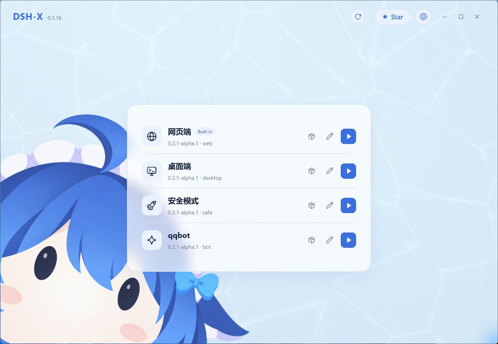
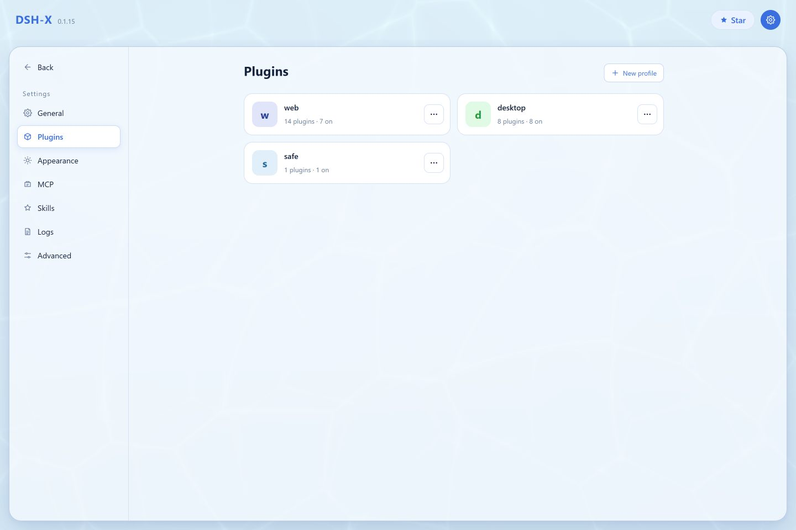
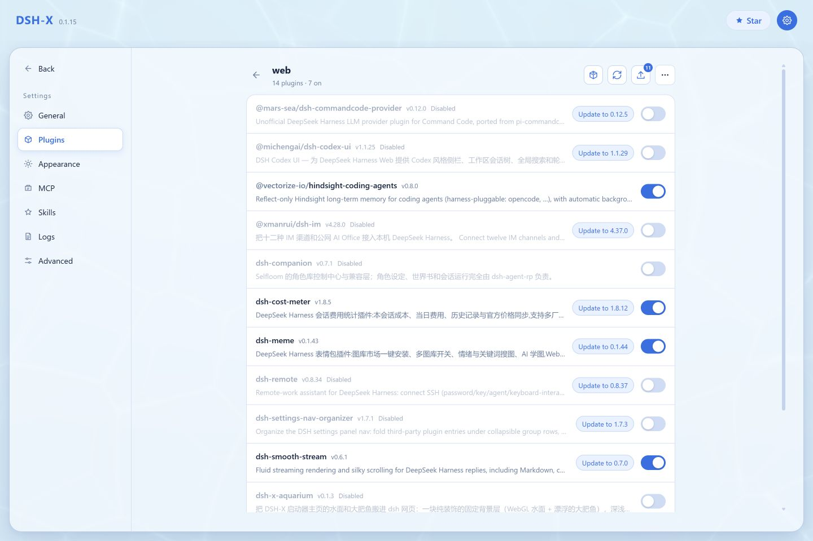
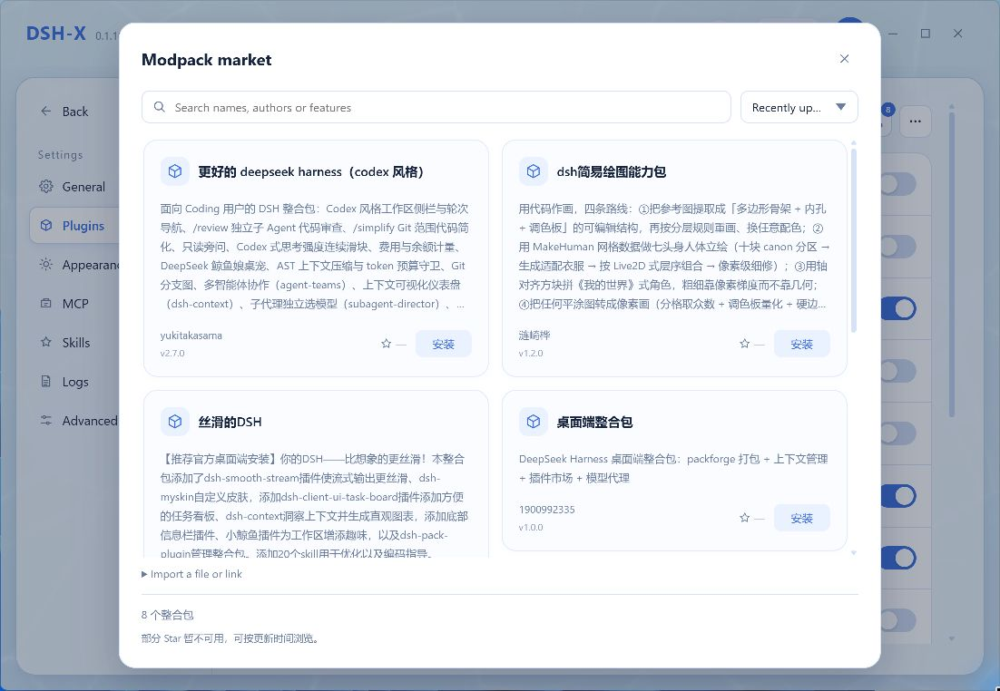
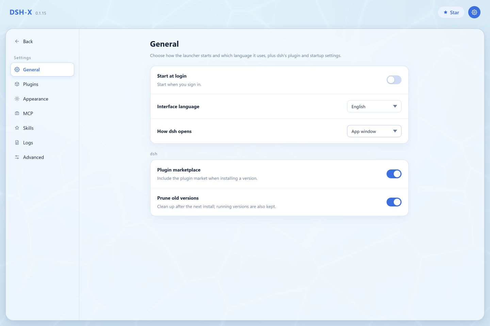

<p align="center">
  
</p>

<p align="center">
  <a href="https://yyh-001.github.io/DSH-X/">Website</a>
  ·
  <a href="https://github.com/yyh-001/DSH-X/releases/latest/download/DSH-Setup.exe">Download</a>
  ·
  <a href="https://github.com/yyh-001/DSH-X">Star</a>
  ·
  <a href="README.md">中文</a>
</p>

A lightweight desktop launcher for DeepSeek Harness: launch entries, multiple instances, versions, plugins, modpacks, MCP and skills.

> [!IMPORTANT]
> **DSH-X starts DeepSeek Harness's own web page.**  
> It only handles version installation, launching and plugin management and never modifies or rewrites DSH's web UI. DSH-X is a community project, not an official DeepSeek product.

## Features

- **Launch entries and multiple instances**: choose a dsh home directory, profile, version and port for each entry; different profiles of the same version can run together.
- **Plugins and packs**: install, toggle and update plugins by environment; import packs from the community market or a file, and export your own environment.
- **MCP and skills**: configure MCP servers and import, manage and toggle skills.
- **Opening modes**: a system browser tab, standalone browser window or desktop window.
- **Appearance**: light / dark themes, transparency, and separate background and Big Fish switches.
- **Updates and recovery**: self-update, profile recovery and configurable old-version retention; each launch entry's current and previous versions are kept additionally.
- **Windows / macOS**: a Windows installer and Apple Silicon / Intel dmgs, tray / menu bar operation and launch at login, with Node / npm / pnpm included.

Feedback: **QQ group [993579665](https://qm.qq.com/q/7AD2g70HqS)**

## Modpacks

Packs install a group of plugins and configuration into a selected environment (profile). The Plugins page lists environments, identifies installed packs and lets you toggle individual plugins. Packs use the [DSH-PackForge](https://github.com/DSH-PackForge/DSH-PackForge) `.dspack` format (manifest v5, older versions accepted).

- **Import**: the community market, a local file, a direct link or GitHub `owner/repo`. The selected environment is the default target; change it before confirming if needed.
- **Install**: review plugins and file changes before confirming; overwritten files are backed up and failed installs roll back.
- **Export**: package the current environment's dependencies, patch layer and configuration as a `.dspack`, without `node_modules` or credentials.

The [recommended pack recipe](packs/dsh-x-recommended/manifest.json) includes configuration, memory, sync and Big Fish decoration plugins, all installed from npm. Sync is provided by the optional `dsh-x-sync` plugin. Run `node scripts/make-pack.mjs` to build a `.dspack`, then import it as a local file.

## Screenshots

The current interface, captured at a fixed 1440 × 960 resolution.

<p align="center">
  
</p>

<p align="center">
  
</p>

<p align="center">
  
</p>

<p align="center">
  
</p>

<p align="center">
  
</p>

## Wallpaper

A companion Wallpaper Engine wallpaper — [DSH-X · 大肥鱼桌面终端](https://steamcommunity.com/sharedfiles/filedetails/?id=3814706575): a DSH-X brand intro, the mascot, local time and an audio spectrum, switching between light and dark palettes by time of day. Sources live in [`wallpaper/`](wallpaper/); run `node scripts/export-wallpaper.mjs` to export the Wallpaper Engine project.

<p align="center">
  
</p>

## Signing and antivirus false positives

The release-manifest signature verifies file integrity and is separate from Windows publisher signing. `DSH-Setup.exe` currently has no Authenticode signature, so SmartScreen may show an "unknown publisher" prompt. Report antivirus false positives by submitting the installer to [Microsoft](https://www.microsoft.com/en-us/wdsi/filesubmission) or the relevant antivirus vendor.

## Usage

Windows: install [DSH-Setup.exe](https://github.com/yyh-001/DSH-X/releases/latest), then open **DSH-X** from the desktop.

macOS: open `DSH-X-mac-arm64.dmg` (Apple Silicon) or `DSH-X-mac-x64.dmg` (Intel) and drag **DSH-X** into Applications. v0.1.15 uses ad-hoc signing and is not notarized; the first launch may require manual approval through macOS security prompts.

Add or edit a launch entry on the home page, select its environment and version, then start it. Choose a browser, a separate window or **tabs inside DSH-X** in Settings. The manager defaults to port `3780` and tries the next port if occupied. To reach dsh from another device: Settings → Advanced → **Web binding** → LAN, applied on the next start.

Verifying a download (optional): the releases page lists a sha256 next to every file — compare it locally with `certutil -hashfile DSH-Setup.exe SHA256` (Windows) or `shasum -a 256 DSH-X-mac-arm64.dmg` (macOS).

## Development

Needs Node.js 22.18+ locally, with no third-party dependencies to install. Run `npm start` for the manager, `npm run server` for the server only, and `npm test` for tests.

## Packaging

```sh
npm run dist
```

On Windows (Rust and Inno Setup 6) this produces `release/DSH/` and `release/DSH-Setup.exe`; on macOS (Rust and the Xcode command line tools) it produces `release/DSH-X.app` and `release/DSH-X-mac-<arch>.dmg` (Intel: `DSH_MAC_ARCH=x64 npm run dist`).

Windows builds also write an SBOM and release manifest for local checking (not uploaded to the release). Check the version and artifacts before publishing:

```sh
node scripts/release-manifest.mjs check-tag v0.1.15
node scripts/release-manifest.mjs verify
```

The GitHub Actions `build` workflow builds installers for all three platforms; publish once all are ready. Mac tag builds require [a persistent signing certificate](docs/mac-signing.md); manual builds use ad-hoc signing when no certificate is configured.

The release-manifest private key lives in `release/release-key.pem` (git-ignored, **back it up**).
