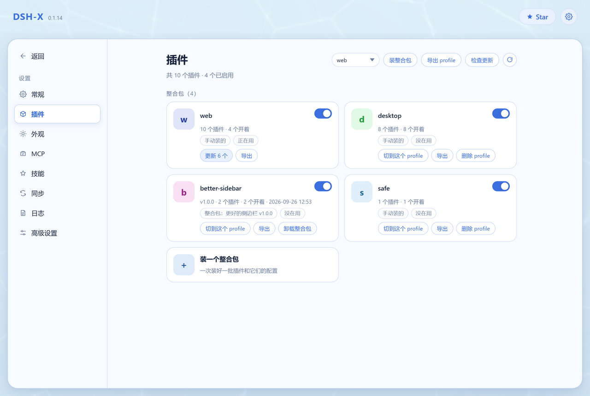
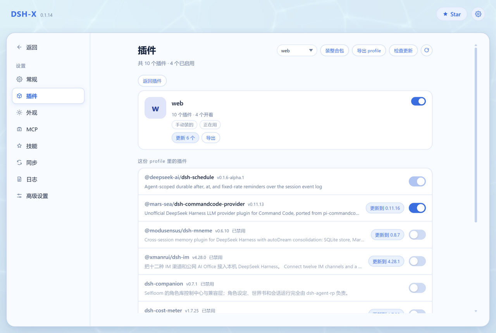

<p align="center">
  
</p>

<p align="center">
  <a href="https://yyh-001.github.io/DSH-X/">主页</a>
  ·
  <a href="https://github.com/yyh-001/DSH-X/releases/latest/download/DSH-Setup.exe">下载</a>
  ·
  <a href="https://github.com/yyh-001/DSH-X">Star</a>
  ·
  <a href="README.en.md">English</a>
</p>

DeepSeek Harness 轻量启动器。选一个版本，启动 DSH web。

> [!IMPORTANT]
> **DSH-X 启动的是 DeepSeek Harness 官方原版 Web 页面。**  
> 它只负责版本安装、启动和插件管理，不修改也不重做 DSH 的网页界面。DSH-X 本身是社区开源项目，并非 DeepSeek 官方产品。

## 功能

- **选版本即用**：启动 / 停止 / 重启 / 更新 / 卸载
- **多操作系统**：Windows 与 macOS 都有原生安装包（macOS 分 Apple Silicon 与 Intel 两份），自更新、开机自启、选目录都用各系统自己的方式
- **插件页**：列出已装插件一键开关，可检查并更新插件（单个 / 全部），profile 也在这里切换
- **整合包**：一次装好一批插件和它们的配置（含社区市场、导入导出），细节见下面「整合包」一节
- **兼容模式**：启动失败按报错自动禁用出问题的插件（可一键恢复）；启动后自检页面引用的客户端插件包，管理页给出结论（区分实例问题和旧标签页）
- **同步 / 导出即备份**：会话记录、附件和插件配置传到 S3 兼容的存储桶或 WebDAV 目录（坚果云 / Nextcloud / 群晖 / Alist…），换机器时拉回来；也可以导出到一个本地文件夹、或打成一个 .zip 再导回来（不联网、不要账号）。插件清单两个方向都合并，不会丢掉任何一边装的插件
- **深色外观**：跟随系统或手动指定，另有悬浮窗透明度与看板娘开关
- **启动加速**：在 bundle 合成处挂等价快实现（约省 1–2 秒），dsh 升级后自动跳过
- **插件跟官方走**：数据在用户目录 `.dsh`，换版本不用重装插件
- **更新留旧版**：只保留最新的和最近装的一个（回退够用），更旧的装完自动清理
- **常驻后台**：关掉网页不退出（Windows 托盘 / macOS 菜单栏图标），界面走系统浏览器
- **自带 Node / npm / pnpm**：安装包里有便携运行时与镜像源 npmmirror，插件安装不依赖系统环境
- **同时只跑一个版本**：避免不同版本争用端口和数据
- **首次安装可预装市场**：可自动安装 `dshmarket`

交流 / 反馈：**QQ 群 [993579665](https://qm.qq.com/q/7AD2g70HqS)**（[点击加入](https://qm.qq.com/q/7AD2g70HqS)）

## 整合包

一次装好一批插件和它们的配置，不用一个个装、一条条改。整合包在插件页里一张卡一个——**一张卡就是一份 profile**（装完整合包，产物正是它），手动拼出来的 profile 也在列表里，装过包的那张标着来源；点进去能看到这份 profile 里的插件，每个还能单独开关。格式用生态里的 [DSH-PackForge](https://github.com/DSH-PackForge/DSH-PackForge) `.dspack`（manifest v5，兼容旧版本），和其他第三方启动器的包互通。

- **从哪装**：本地 `.dspack` 文件、直链，或 GitHub 的 `owner/repo`（自动取最新 Release 里的包）；也可以直接在页面上从内置的社区市场里挑。
- **装到哪**：默认装进一个独立的 profile，和现有环境互不打扰；也可以改成 `web` 之类现有 profile 并进去，装完在页面上切过去并重启。
- **装之前先说清**：层栈、依赖、要写的文件、会覆盖什么、包里有哪些内容不会装（凭据、`.npmrc`、整机设置这些一律不落盘）。确认了才动手。
- **出错能退回来**：安装前备份被覆盖的文件，装失败自动回滚，卸载时还原；包自建的 profile 可以连目录一起删掉。
- **自己也能发一个**：把当前 profile 导出成 `.dspack`（钉版依赖 + 补丁层 + 配置文件，不含 `node_modules` 与凭据），别人装上就是同样的插件环境。

## 界面预览

<p align="center">
  
</p>

<p align="center">
  
</p>

<p align="center">
  
</p>

<p align="center">
  
</p>

<p align="center">
  
</p>

## 杀软误报

启动器没有代码签名，行为又和启发式里的「下载器」有几分像（会拉起 `cmd` / `powershell`、能写开机自启、自带 Node 运行时、自更新时下载安装包），所以偶尔会被 Windows Defender 或其他杀软拦下。

被拦了：把安装目录（默认 `%LOCALAPPDATA%\Programs\DSH`）加进排除项；误报可以提交给[微软](https://www.microsoft.com/en-us/wdsi/filesubmission)（选「软件开发者」，上传 `DSH-Setup.exe`），一般 1–2 天撤销，国内杀软（360、火绒等）同理。下载后 SmartScreen 提示「未知发布者」是正常的，点「仍要运行」。

## 使用

Windows：[下载 DSH-Setup.exe](https://github.com/yyh-001/DSH-X/releases/latest) 安装，从桌面打开 **DSH-X**。

macOS：打开 `DSH-X-mac-arm64.dmg`（Apple Silicon）或 `DSH-X-mac-x64.dmg`（Intel），把 **DSH-X** 拖进「应用程序」。应用没做公证，第一次打开要右键选「打开」；自更新也要求放在这种可写目录里。设置和日志在 `~/Library/Application Support/DSH`。

管理页和 dsh 的界面都在系统浏览器里打开，管理页默认 `http://127.0.0.1:3780/`（端口可在设置页改）。想让手机或其他电脑访问 dsh：设置页 → 高级设置 → **Web 绑定**选「局域网」，下次启动 dsh 生效。

核对下载到的包（可选）：Release 页面每个文件旁边有 sha256，本地对一下即可 —— Windows `certutil -hashfile DSH-Setup.exe SHA256`，macOS `shasum -a 256 DSH-X-mac-arm64.dmg`。

## 开发

本机需要 Node.js 22.18+。`npm install` 之后 `npm start`；只起网页用 `npm run server`。

## 打包

```sh
npm run dist
```

Windows（需要 Rust 与 Inno Setup 6）产出 `release/DSH/` 便携目录和 `release/DSH-Setup.exe`；macOS（需要 Rust 与 Xcode 命令行工具）产出 `release/DSH-X.app` 和 `release/DSH-X-mac-<arch>.dmg`（Intel 版：`DSH_MAC_ARCH=x64 npm run dist`）。

打包还会顺带生成 SBOM 与发布清单（自查用，不上传 Release）。发版时先过两道闸门，再把安装包和 dmg 一起传上去：

```sh
node scripts/release-manifest.mjs check-tag v0.1.14   # tag 必须与 package.json 的版本一致
node scripts/release-manifest.mjs verify              # 逐个产物核对哈希（有私钥时一并验签）
gh release create v0.1.14 release/DSH-Setup.exe release/mac/DSH-X-mac-*.dmg --latest
```

私钥在 `release/release-key.pem`（已被忽略、不进仓库，**务必备份**）。`scripts/release-manifest.mjs` 的头部注释里有 keygen、单独核对某个目录等其余用法。

