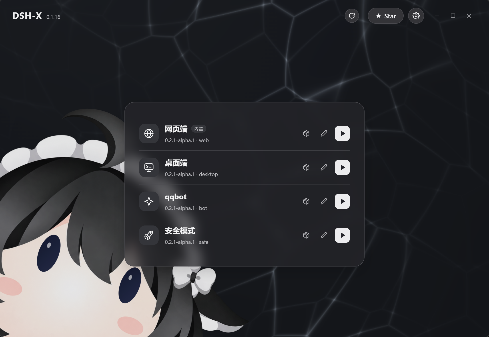
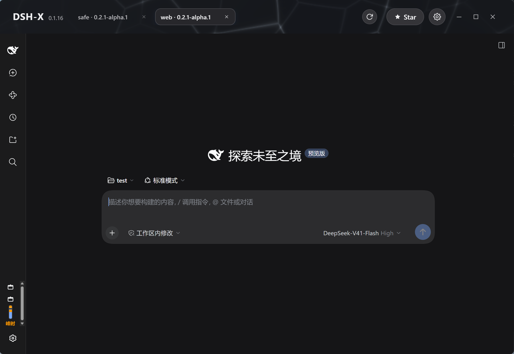
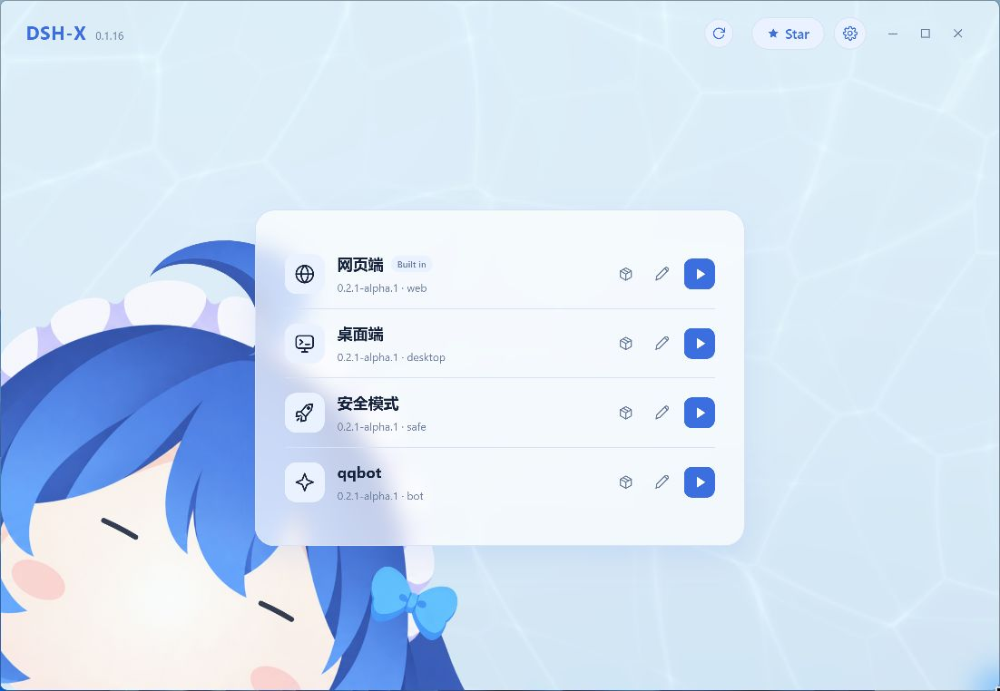
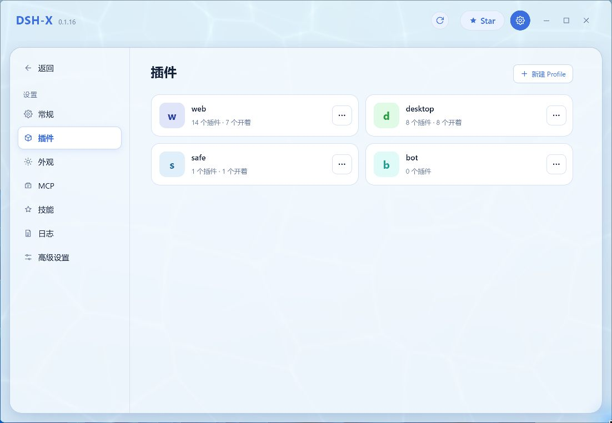
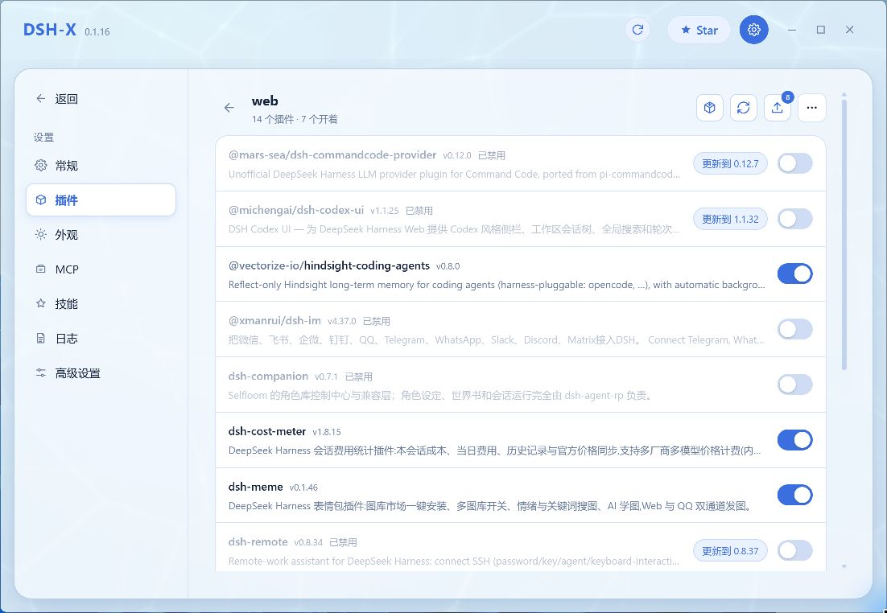
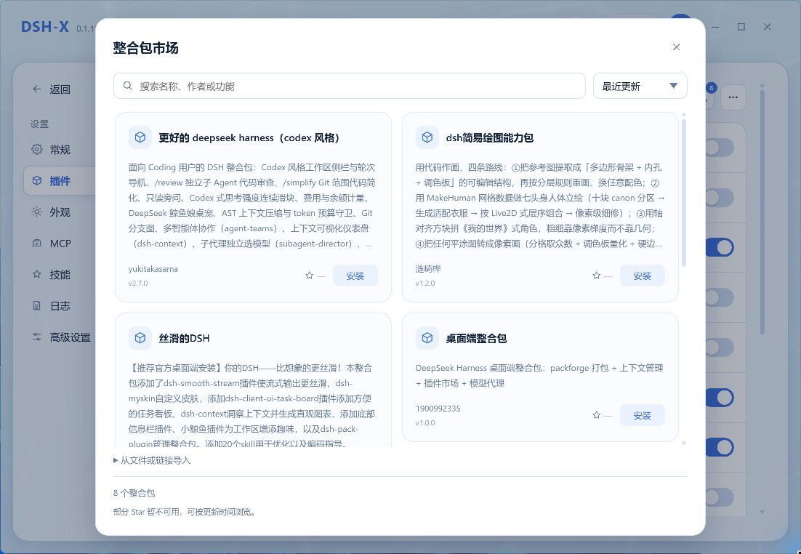
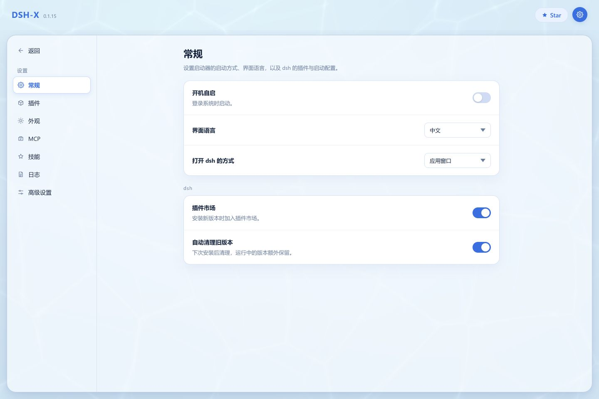
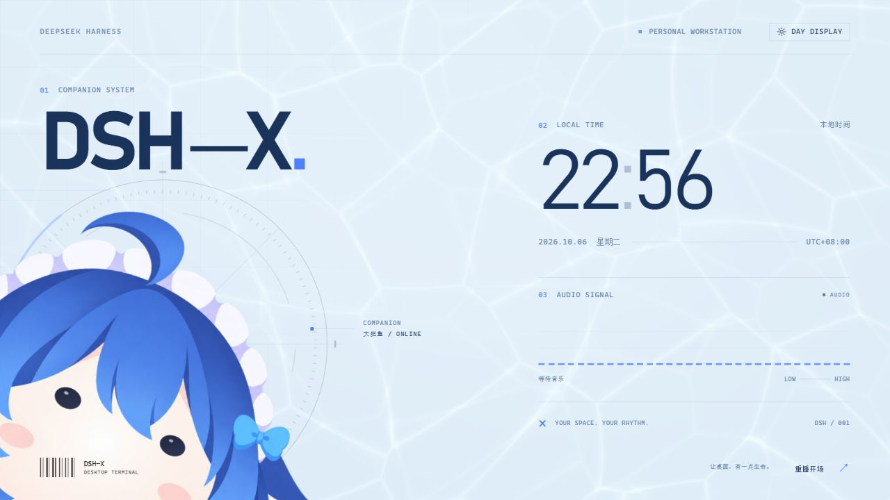

<p align="center">
  
</p>

<p align="center">
  <a href="https://yyh-001.github.io/DSH-X/">主页</a>
  ·
  <a href="https://github.com/yyh-001/DSH-X/releases/latest/download/DSH-Setup.exe">下载</a>
  ·
  <a href="https://github.com/yyh-001/DSH-X">Star</a>
  ·
  <a href="README.en.md">English</a>
</p>

DeepSeek Harness 轻量桌面启动器：启动项与多实例，版本、插件、整合包、MCP 和技能管理。

> [!IMPORTANT]
> **DSH-X 启动的是 DeepSeek Harness 官方原版 Web 页面。**  
> 它只负责版本安装、启动和插件管理，不修改也不重做 DSH 的网页界面。DSH-X 本身是社区开源项目，并非 DeepSeek 官方产品。

## 功能

- **启动项与多实例**：按项选择用户目录、profile、版本和端口；支持并行启动，运行中也可添加启动项。
- **版本管理**：独立管理已安装版本，支持手动安装、卸载和为启动项指定版本。
- **插件与整合包**：按环境安装、开关和更新插件；社区市场支持瀑布流浏览、搜索和排序，也可导入、导出整合包。
- **MCP 与技能**：配置 MCP 服务器，导入、管理和开关技能。
- **多种打开方式**：DSH-X 内部标签页、系统浏览器标签页、浏览器独立窗口或桌面窗口。
- **外观**：浅色 / 深色主题、透明度、开场与启动项动效，以及独立的背景和大肥鱼开关。
- **更新与恢复**：自更新、故障恢复、可设置保留数量的旧版本清理；启动项当前与上一次使用的版本额外保留。
- **Windows / macOS**：提供 Windows 安装包与 Apple Silicon / Intel 两种 dmg，支持托盘 / 菜单栏常驻和开机自启，自带 Node / npm / pnpm。

交流 / 反馈：**QQ 群 [993579665](https://qm.qq.com/q/7AD2g70HqS)**（[点击加入](https://qm.qq.com/q/7AD2g70HqS)）

## 整合包

整合包把一组插件和配置装进选定的环境（profile）。插件页按环境展示，装过包的环境会标明来源，插件仍可单独开关。使用 [DSH-PackForge](https://github.com/DSH-PackForge/DSH-PackForge) `.dspack` 格式（manifest v5，兼容旧版本）。

- **导入**：社区市场、本地文件、直链或 GitHub `owner/repo`。默认安装到当前选中的环境，确认前可切换目标。
- **安装**：先查看插件和文件变更，再确认安装；覆盖前备份，失败自动回滚。
- **导出**：把当前环境的依赖、补丁层与配置打成 `.dspack`，不含 `node_modules` 与凭据。

仓库中的 [推荐整合包配方](packs/dsh-x-recommended/manifest.json) 包含配置管理、记忆、同步和大肥鱼装饰插件，均从 npm 安装。同步由可选插件 `dsh-x-sync` 提供。运行 `node scripts/make-pack.mjs` 可生成 `.dspack`，再作为本地文件导入。

## 界面预览

**多启动项 · 深色主题**

<p align="center">
  
</p>

**多标签页 · 深色主题**

<p align="center">
  
</p>

<details>
<summary>浅色主题与管理界面（展开查看）</summary>

**启动器主页**

<p align="center">
  
</p>

**环境列表**

<p align="center">
  
</p>

**插件管理**

<p align="center">
  
</p>

**整合包市场**

<p align="center">
  
</p>

**常规设置**

<p align="center">
  
</p>

</details>

## 动态壁纸

配套的 Wallpaper Engine 壁纸[《DSH-X · 大肥鱼桌面终端》](https://steamcommunity.com/sharedfiles/filedetails/?id=3814706575)：DSH-X 品牌开场、大肥鱼、本机时间与音乐频谱，按时间自动切换深浅配色。源码在 [`wallpaper/`](wallpaper/)，`node scripts/export-wallpaper.mjs` 导出 Wallpaper Engine 工程。

<p align="center">
  
</p>

## 签名与杀软误报

发布清单的签名用于校验文件完整性，与 Windows 发布者签名不同。目前 `DSH-Setup.exe` 尚未进行 Authenticode 签名，可能出现 SmartScreen「未知发布者」提示。杀软误报可向[微软](https://www.microsoft.com/en-us/wdsi/filesubmission)或对应杀软厂商提交安装包申诉。

## 使用

Windows：[下载 DSH-Setup.exe](https://github.com/yyh-001/DSH-X/releases/latest) 安装，从桌面打开 **DSH-X**。

macOS：打开 `DSH-X-mac-arm64.dmg`（Apple Silicon）或 `DSH-X-mac-x64.dmg`（Intel），把 **DSH-X** 拖进「应用程序」。v0.1.16 使用临时签名，未做公证，首次打开可能需要在系统安全提示中手动允许。

在主页添加或编辑启动项，选择环境与版本后启动；编辑启动项时可打开 **版本管理**，手动安装或卸载版本。设置 → 常规 → **打开 dsh 的方式** 可选择 DSH-X 内部标签页、浏览器或独立窗口。内部标签页需要使用安装后的桌面端。

管理页默认端口为 `3780`，被占用时会顺延。手机或其他电脑访问 dsh：设置 → 高级设置 → **Web 绑定**选「局域网」，下次启动生效。

核对下载到的包（可选）：Release 页面每个文件旁边有 sha256，本地对一下即可 —— Windows `certutil -hashfile DSH-Setup.exe SHA256`，macOS `shasum -a 256 DSH-X-mac-arm64.dmg`。

## 开发

本机需要 Node.js 22.18+，无需安装第三方依赖。`npm start` 启动管理页；只起服务用 `npm run server`，测试用 `npm test`。

## 打包

```sh
npm run dist
```

Windows（需要 Rust 与 Inno Setup 6）产出 `release/DSH/` 便携目录和 `release/DSH-Setup.exe`；macOS（需要 Rust 与 Xcode 命令行工具）产出 `release/DSH-X.app` 和 `release/DSH-X-mac-<arch>.dmg`（Intel 版：`DSH_MAC_ARCH=x64 npm run dist`）。

Windows 打包同时生成 SBOM 与发布清单（本地自查，不上传 Release）。发版前检查版本与产物：

```sh
node scripts/release-manifest.mjs check-tag v0.1.16
node scripts/release-manifest.mjs verify
```

GitHub Actions 的 `build` 工作流可构建三个平台的安装包，全部齐全后再发布。Mac 标签构建要求[固定证书配置](docs/mac-signing.md)，未配置时手动构建使用临时签名。

发布清单的私钥在 `release/release-key.pem`（已被忽略、不进仓库，**务必备份**）。

