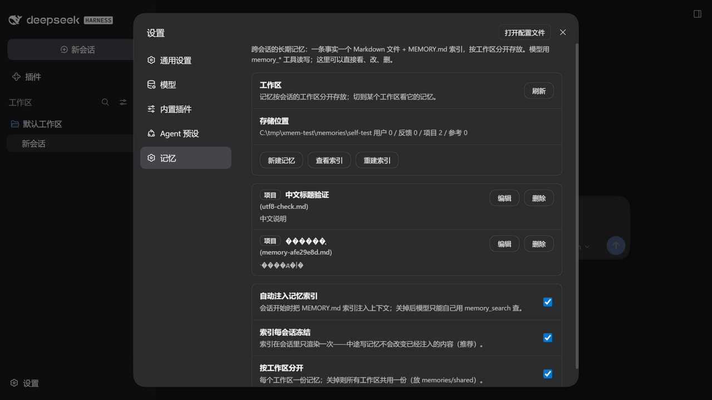

# dsh-x-memory

给 [DeepSeek Harness](https://github.com/deepseek-ai/deepseek-harness)（dsh）的文件式长期记忆插件 —— 照 [ZCode](https://github.com/zai-org/ZCode) 那套记忆的语义实现：

**一条事实一个 Markdown 文件**，按工作区分开存放，配一份 `MEMORY.md` 索引；模型用六个 `memory_*` 工具读写，会话开始时把索引注入上下文。**文件就是记忆本体** —— 随时能打开看、手改、删掉、进 git；插件卸载了它们还在。

## 装上

**DSH-X 用户不需要手动装**：安装包自带这件插件（`plugins/dsh-x-memory`），启动时由启动器预置进当前 profile —— 设置页 → dsh 分组里的「记忆插件」开关控制（默认开）。预置会把插件复制一份到 `$DSH_HOME/bundled/`，所以卸载 DSH-X 之后 profile 里也不会留下断链。

手动装（任何 dsh 环境）：

```powershell
dsh plugin --profile web add -w github:yyh-001/dsh-x-memory --config.auto-install-peers=false
```

装之前先停 dsh（运行中装会因为文件被锁留下半残包）；装完重启 `dsh web`。设置页里会出现「记忆」一块：



## 它长什么样

```
<DSH_HOME>/memories/<工作区>/
├── MEMORY.md                    # 索引：一行一条 `- [标题](文件.md) — 一句话说明`
├── dsh-plugin-install-recipe.md # 一条事实一个文件
└── memory-1f3c9a2b.md           # 中文标题自动回退成哈希名（工具也接受显式 slug）
```

单个记忆文件的形状（frontmatter + 正文，和 ZCode 一致）：

```markdown
---
name: dsh-plugin-install-recipe
title: dsh 插件安装方法
description: 走 dsh plugin 才会进 bundles；必须关掉 peer 自动安装
metadata:
  type: project
---

装第三方插件到 profile 的正确姿势……相关：[[dsh-profile-management]]
```

`type` 四选一，和 ZCode 一样：`user`（用户是谁）/ `feedback`（工作方式，含 Why 与 How to apply）/ `project`（项目事实，相对日期换绝对日期）/ `reference`（外部资源指针）。

## 模型怎么用它

六个工具：`memory_save` / `memory_search` / `memory_list` / `memory_read` / `memory_update` / `memory_delete`。

提示词里注册了一条**静态**的「写记忆的纪律」（照 ZCode 的 Memory 段改写）：什么时候该记、什么时候不该记（仓库里已有的、只跟本次对话有关的）、保存前先查重、更新优于新建、错了就删。静态文本进前缀缓存，不抖。

索引走**动态 context**、每会话只渲染一次：会话过半时新写的记忆不会改变已经注入的内容（对应 ZCode 的「索引每会话载入」；也避免上下文抖动）。想让它每轮都刷新，把 `freezeIndexPerSession` 关掉。

## 设置页「记忆」

- 按工作区看条目：标题、类型、说明、大小；点开可编辑，可删除（真删文件）；
- 看 / 重建 `MEMORY.md` 索引；
- 三个开关：`autoInject`（是否注入索引；关掉=只留工具）、`freezeIndexPerSession`、`perWorkspace`（关掉则所有工作区共用 `memories/shared`）。

面板改的是 `<profileDir>/dsh-x-memory.json`（覆盖层），**保存即生效**，不用重启 dsh。`cordis.patch.yml` 里那一行 `config:` 是另一层（patch 行 > 默认值，面板覆盖 > patch 行）。自定义记忆根目录用 `rootDir`（面板里没暴露，改 patch 行或这个 JSON）。

## 与其他记忆插件的区别

| | dsh-x-memory | 数据库型（如 dsh-mneme） | 自动捕获型（如 claude-mem） |
|---|---|---|---|
| 本体 | Markdown 文件 + 索引 | SQLite（md 只是镜像） | SQLite + 向量库 |
| 写什么 | 精选事实（模型判断该不该记） | 结构化条目 | 自动捕获全部会话观察 |
| 取用 | 索引常驻 + 工具按需读 | 向量/关键词检索注入 | 语义检索 + 会话开始注入 |
| 人能不能直接改 | 能，就是文件 | 不直接 | 不能 |

同一个 profile 里**建议只留一套记忆系统**：两套都往上下文里注入，会重复且互相干扰。

## 开发

```powershell
node --test          # 17 个用例：frontmatter/索引/检索/路径安全/工具端到端
```

- `lib/store.js`：记忆库（不 import 任何 dsh 包，纯 node，单测直接调）；
- `lib/tools.js`：六个工具（假的 `defineTool` 就能测）；
- `lib/index.js`：提示词注入、路由、配置解析；
- `lib/client.js`：设置页面板（`window.__ModuleLoader__` 形态）。

隔离验证套路（不碰真实 `~/.dsh`）：

```powershell
$env:DSH_HOME='C:\tmp\xmem-test'
node <dsh>/lib/bin.js web --host 127.0.0.1 --port 3951 --no-open
```

## 许可

MIT
